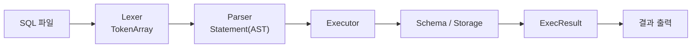
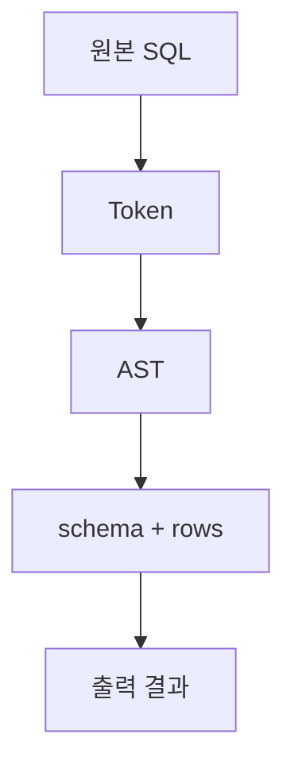
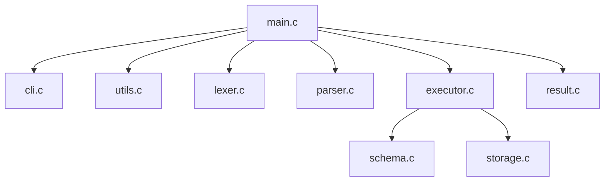
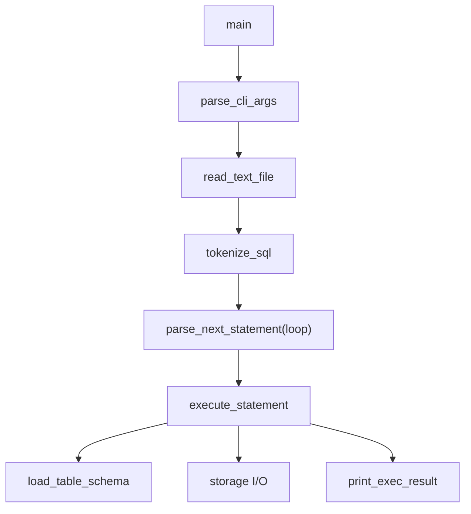
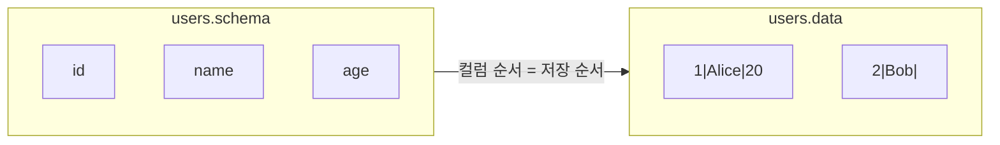
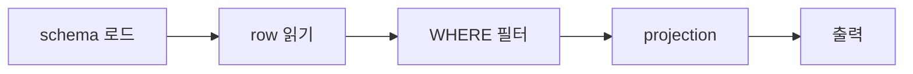
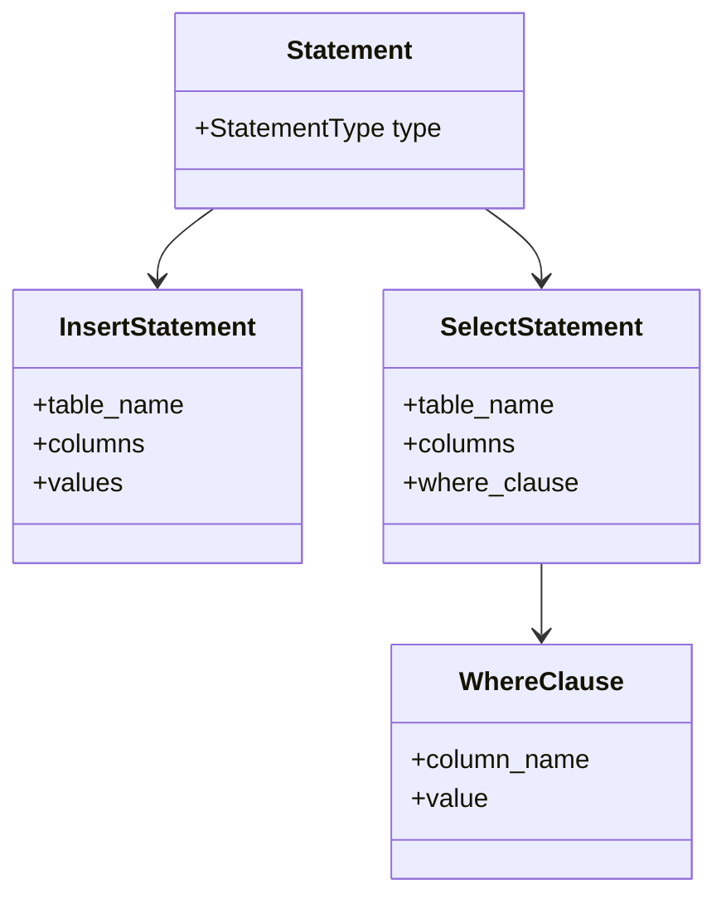
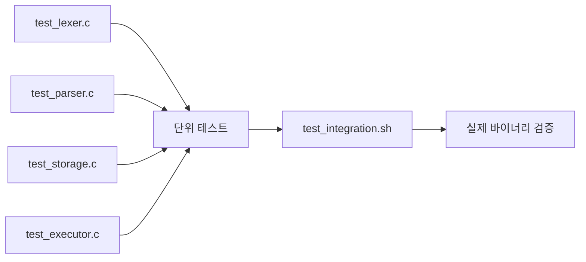
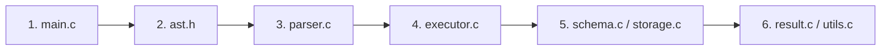

# SQL Parser Engine

- 한 줄: `SQL file -> Token -> AST -> Execute -> File DB -> Output`
- 발표 포인트: 기능 소개보다 판단 과정
- 팀 기준: Top-Down, 병렬 구현, 설명 가능성, 테스트

## 1. 프로젝트 한눈에 보기



- 입력: `.sql` 파일
- 출력: 실행 결과
- 핵심 흐름: 읽기 -> 해석 -> 실행 -> 저장 -> 출력

## 2. 왜 이 프로젝트를 만들었는가

- 과제 해석: SQL 기능 2개 구현보다 처리기 구조 구현
- 팀 질문: `SQL 문자열이 어떤 구조를 거쳐 실행되는가`, `구조를 나눈 이유를 끝까지 설명할 수 있는가`
- 팀 목표: `main -> parser -> executor -> storage` 흐름 설명 가능
- 팀 기준: 빠른 구현 + 구조 이해 + 발표 가능 상태

## 3. 지원 범위

- 지원: `INSERT`, `SELECT`, `WHERE column = literal`
- 추가 구현: 여러 줄 SQL, 여러 문장 SQL, `id` 중복 차단, 스키마 변경 후 기존 row 읽기
- 제외: `CREATE TABLE`, `UPDATE`, `DELETE`, `JOIN`, 복합 `WHERE`, 인덱스, 트랜잭션

## 4. Top-Down 관점의 전체 흐름



- 핵심 추상화: `Token`, `AST`, `Row`
- 해석 기준: 문자열 직접 실행 X / 구조 기반 실행 O

## 5. 모듈 구조



- `main`: 전체 순서 조립
- `cli`: 실행 옵션 해석
- `lexer`: token 분해
- `parser`: AST 생성
- `executor`: 실행 규칙 적용
- `schema`: `<table>.schema` 로드
- `storage`: `<table>.data` 읽기/쓰기
- `result`: 출력 포맷

## 6. 함수 호출 흐름



- 문제: 한 줄 SQL 가정은 실제 입력과 거리
- 선택: `parse_next_statement(loop)`
- 의미: 여러 줄 SQL 처리, 세미콜론 단위 순차 실행, 한 파일 내 여러 문장 처리

## 7. 저장 구조



| 후보 | 장점 | 한계 |
| --- | --- | --- |
| binary | 빠른 처리 가능 | 사람이 읽기 어려움 |
| CSV | 익숙한 형식 | 구분/escape 관리 부담 |
| `|` text | 직접 확인 쉬움 | 성능 최적화 목적과는 거리 |

- 문제: 디버깅과 테스트에서 파일 직접 확인 필요
- 선택: `|` 구분자 텍스트 포맷
- 의미: 기대값 비교 용이, 파일 상태 확인 용이, 발표 데모 용이
- 저장 규칙: 한 줄 = 한 row, 명시되지 않은 값 = `""`, row 부족 컬럼 = 빈 문자열 채움, 초과 컬럼 = 잘라냄, escape = `\\`, `\|`, `\n`

## 8. INSERT 흐름


- 문제: partial insert 시 컬럼 순서 불일치, 중복 `id` 허용 시 데이터 모호
- 선택: schema 순서 기준 row 재구성, 삽입 전 기존 row와 `id` 비교
- 의미: 입력 순서와 저장 순서 분리, 파일 기반 DB에서도 최소 무결성 확보

## 9. SELECT 흐름



- 문제: `SELECT *`만으로 구조 확장성 확인 어려움
- 선택: `WHERE column = literal`
- 의미: Parser -> Executor 확장성 확인, 조건 필터 + projection 분리

## 10. AST 구조



- 목적: 문자열 직접 해석 제거
- 효과: Parser / Executor 책임 분리

## 11. 디렉터리 구조

```text
sql-parser-engine/
├─ src/       실행 로직
├─ include/   헤더 / 인터페이스
├─ db/        schema 파일
├─ queries/   데모 SQL
├─ tests/     단위 / 통합 테스트
└─ docs/      작업지시서 / 학습자료 / 발표 대본
```

## 12. 빌드와 실행

```sh
make
./sql_processor -d ./db -f ./queries/insert_users.sql
./sql_processor -d ./db -f ./queries/select_users.sql
./sql_processor -d ./db -f ./queries/select_user_where.sql
./sql_processor -d ./db -f ./queries/multi_statements.sql
```

- 컴파일 옵션: `-std=c99 -Wall -Wextra -Werror`
- 도움말: `./sql_processor --help`

## 13. 테스트 전략



- 실행: `make && make test`
- 검증 포인트: Lexer token 분해, Parser AST 생성, Storage escape/read/write, Executor INSERT/SELECT 규칙, Integration 실제 실행 결과
- 추가 검증: 여러 문장 SQL, `WHERE` 결과 0건, 중복 `id`, 스키마 변경 후 row 읽기

## 14. 예제 결과

```text
INSERT 1

id | name  | age
----------------
1  | Alice | 20
2  | Bob   |

2 rows selected
```

## 15. 우리가 사용한 협업 방식


- 협업 기준: Top-Down 이해, 모듈 경계 확정, 병렬 구현, Low-level 코드 확인, 발표 가능 상태 정리

## 16. 처음 읽을 때 추천하는 코드 읽기 순서



- 읽기 목적: 전체 흐름 먼저, 데이터 구조 다음, 실행 규칙 마지막

## 17. 엣지 케이스

- 빈 SQL 파일
- 닫히지 않은 문자열
- 잘못된 토큰
- 여러 줄 SQL
- 여러 문장이 한 파일에 있는 경우
- 존재하지 않는 테이블
- 존재하지 않는 컬럼
- `INSERT` 값 개수 불일치
- schema 파일 비어 있음
- 스키마 컬럼 추가/제거 뒤 기존 row 읽기
- 부분 컬럼 `INSERT`
- 중복 `id` 삽입
- `WHERE` 결과 0건

## 18. 한계와 향후 개선점

- 현재 한계: `WHERE column = literal`, `id` 컬럼만 유일성 검사, positional 저장 포맷, 인덱스/트랜잭션 미지원, SQL comment/복합 조건 미지원
- 향후 개선: `AND`, `OR`, `<`, `>`, `NULL`, 컬럼 이름 기반 저장 포맷, 출력 정렬 고도화

## 19. 발표용 한 줄 정리

```text
SQL 문자열을 token으로 자르고,
AST로 구조화하고,
그 구조를 파일 기반 DB 위에서 실행해 보는 프로젝트
```
