# SQL Parser Engine

파일 기반 SQL 처리기를 직접 구현하며 작은 DBMS의 핵심 흐름을 따라가는 프로젝트다.  
이 프로그램은 SQL 파일을 읽고, 문법을 해석하고, 파일 DB 위에서 실행한 뒤, 결과를 화면에 출력한다.  
기본 요구사항을 맞추는 데서 멈추지 않고, 실제로 파일 기반 SQL 처리기를 만든다면 어떤 입력과 데이터 문제를 먼저 다뤄야 할지도 함께 고민했다.

## 1. 프로젝트 한눈에 보기

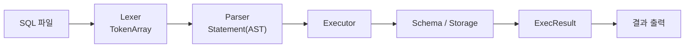

이 프로젝트를 가장 짧게 요약하면 아래와 같다.

```text
읽고 -> 해석하고 -> 실행하고 -> 보여준다
```

## 2. 왜 이 프로젝트를 만들었는가

보통 SQL은 DBMS가 알아서 처리해 주지만, 이번 프로젝트에서는 그 내부 흐름을 직접 구현해 본다.

핵심 목표는 세 가지다.

* SQL 문자열이 어떻게 구조화되는지 이해한다.
* 구조화된 명령이 실제 파일 시스템 위에서 어떻게 실행되는지 이해한다.
* `main -> parser -> executor -> storage` 흐름을 Top-Down으로 설명할 수 있게 만든다.

이번 과제를 진행하면서 저희가 가장 중요하게 본 것은 "기능 수"보다 "처리기 구조를 얼마나 설명할 수 있는가"였다.  
그래서 `INSERT`, `SELECT`를 빠르게 구현하는 것과 별개로, 입력이 조금 현실적으로 바뀌어도 구조가 버티는지, 파일 기반 DB에서도 최소한의 원칙을 반영할 수 있는지도 함께 확인하려 했다.

## 3. 지원 범위

### 지원 SQL

```sql
INSERT INTO users VALUES (1, 'Alice', 20);
INSERT INTO users (id, name, age) VALUES (1, 'Alice', 20);
INSERT INTO users (name, id) VALUES ('Bob', 2);
SELECT * FROM users;
SELECT id, name FROM users WHERE id = 1;
INSERT INTO users VALUES (2, 'Bob', 25);
SELECT * FROM users WHERE id = 2;
INSERT INTO users VALUES (3, 'Carol', 28);
SELECT name FROM users WHERE id = 3;
```

### 제외한 기능

* `CREATE TABLE`
* `UPDATE`
* `DELETE`
* `JOIN`
* 복합 조건 `WHERE` (`AND`, `OR`, 비교 연산자 등)
* 인덱스
* 트랜잭션

## 4. Top-Down 관점의 전체 흐름

Top-Down으로 보면, 이 프로젝트는 "문자열이 점점 의미 있는 구조로 바뀌는 과정"이다.

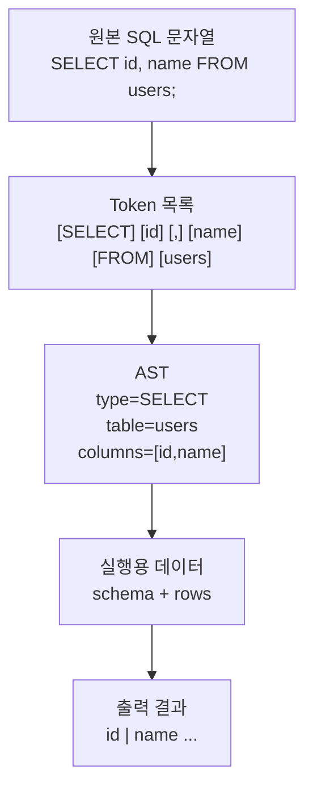

### 핵심 추상화 3개

* `Token`: 문자열을 의미 단위로 잘라 놓은 결과
* `AST`: SQL 문장의 구조를 프로그램이 이해한 결과
* `Row`: 파일에 저장되거나 파일에서 읽혀 나온 실제 데이터 한 줄

## 5. 모듈 구조

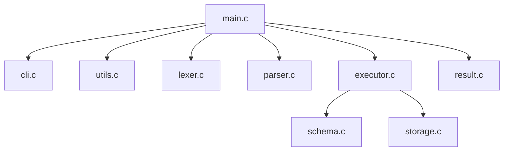

### 각 모듈의 역할

* `main`: 전체 실행 순서를 조립하는 지휘자
* `cli`: DB 경로와 SQL 파일 경로를 해석
* `lexer`: SQL 문자열을 token으로 분해
* `parser`: token 배열을 AST로 변환
* `executor`: AST를 실제 동작으로 연결
* `schema`: `<table>.schema`를 읽어 테이블 구조 로드
* `storage`: `<table>.data` 파일 읽기/쓰기
* `result`: 실행 결과를 사용자 친화적으로 출력
* `utils`: 파일 읽기, 문자열 처리, 메모리 보조 함수

## 6. 함수 호출 흐름

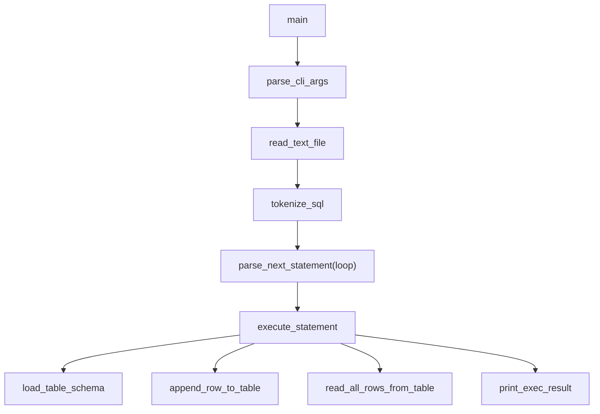

이 그림이 전체 코드를 읽는 가장 빠른 지도다.

## 7. 저장 구조

테이블은 두 파일로 관리한다.

* `<table>.schema`: 컬럼 메타데이터
* `<table>.data`: 실제 row 데이터

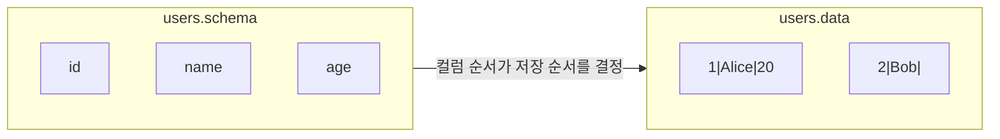

### 예시

`db/users.schema`

```text
id
name
age
```

`db/users.data`

```text
1|Alice|20
2|Bob|
```

저장 포맷은 CSV와 binary도 함께 고민했다.  
binary는 빠를 수 있지만 사람이 직접 읽고 검증하기 어렵고, CSV도 쉼표와 escape를 계속 신경 써야 해서 디버깅과 테스트에 아주 편한 형식은 아니라고 봤다.  
그래서 이 프로젝트에서는 성능보다 확인 가능성을 우선해, 사람이 바로 열어 보고 비교하기 쉬운 `|` 구분자 텍스트 포맷을 선택했다.

### 저장 규칙

* 한 줄이 한 row다.
* 필드 구분자는 `|`다.
* schema 컬럼 순서가 data 저장 순서다.
* 명시되지 않은 컬럼은 빈 문자열 `""`로 저장한다.
* 현재 schema보다 저장 row가 짧으면 부족한 컬럼은 빈 문자열로 채운다.
* 현재 schema보다 저장 row가 길면 초과 컬럼은 잘라낸다.
* escape 규칙은 `\\`, `\|`, `\n`을 사용한다.

## 8. INSERT 흐름

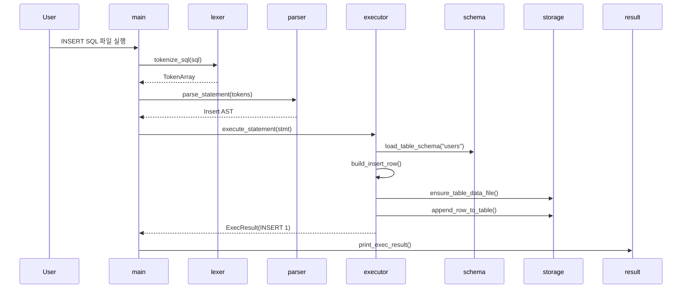

### 예시 SQL

```sql
INSERT INTO users (name, id) VALUES ('Bob', 2);
```

### 내부적으로 일어나는 일

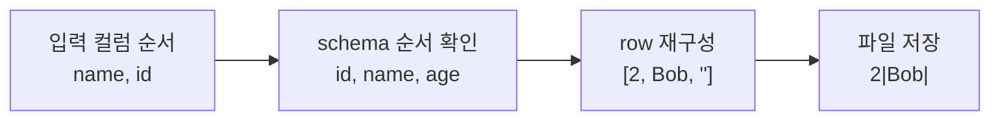

`INSERT`에서 중요한 포인트는 입력 컬럼 순서를 schema 순서에 맞게 다시 정렬하는 것이다.  
여기에 더해, 파일 기반 DB라도 같은 `id`가 계속 들어가면 데이터가 금방 모호해질 수 있다고 판단해, 삽입 전에 기존 row를 확인하고 중복 `id`는 막도록 했다.  
완전한 제약 시스템은 아니지만, 최소한의 데이터 무결성은 지키자는 쪽에 가까운 선택이었다.

## 9. SELECT 흐름

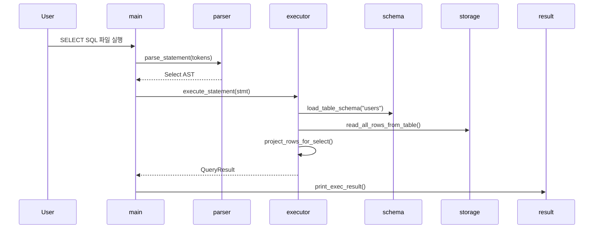

### 예시 SQL

```sql
SELECT name, id FROM users WHERE id = 1;
```

### 내부적으로 일어나는 일

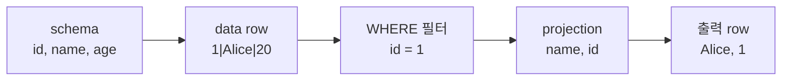

`SELECT`에서 중요한 포인트는 WHERE로 row를 먼저 거르고, 필요한 컬럼만 projection 하는 것이다.  
기본 요구사항은 단순 조회만으로도 충족할 수 있었지만, 조건 기반 조회를 얇게라도 넣어 보면 Parser가 만든 AST를 Executor가 얼마나 자연스럽게 확장해서 처리할 수 있는지 확인할 수 있다고 봤다.  
그래서 `WHERE column = literal` 범위까지만 지원해 구조의 확장 가능성을 검증했다.

## 10. AST 구조

프로그램은 SQL을 문자열 그대로 다루지 않고 AST로 바꿔 다룬다.

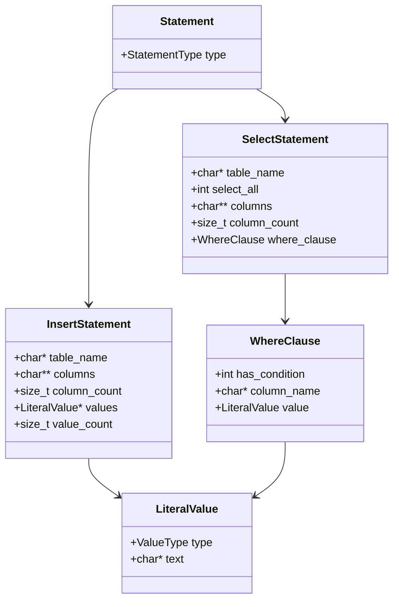

이 구조 덕분에 Executor는 더 이상 "문자열 SQL"을 해석하지 않고, 이미 정리된 명령 구조를 실행하는 데 집중할 수 있다.

## 11. 디렉터리 구조

```text
sql-parser-engine/
├─ Makefile
├─ README.md
├─ db/
│  ├─ users.schema
│  └─ products.schema
├─ docs/
│  ├─ workOrder.md
│  ├─ workOrder_A.md
│  ├─ workOrder_B.md
│  ├─ workOrder_C.md
│  └─ study.md
├─ include/
│  ├─ ast.h
│  ├─ cli.h
│  ├─ errors.h
│  ├─ executor.h
│  ├─ lexer.h
│  ├─ parser.h
│  ├─ result.h
│  ├─ schema.h
│  ├─ storage.h
│  └─ utils.h
├─ queries/
│  ├─ insert_users.sql
│  ├─ select_users.sql
│  ├─ select_user_names.sql
│  ├─ select_user_where.sql
│  ├─ multi_statements.sql
│  └─ invalid_missing_from.sql
├─ src/
│  ├─ main.c
│  ├─ cli.c
│  ├─ lexer.c
│  ├─ parser.c
│  ├─ executor.c
│  ├─ schema.c
│  ├─ storage.c
│  ├─ result.c
│  └─ utils.c
└─ tests/
   ├─ test_lexer.c
   ├─ test_parser.c
   ├─ test_storage.c
   ├─ test_executor.c
   └─ test_integration.sh
```

## 12. 빌드와 실행

### 빌드

```sh
make
```

프로젝트는 아래 옵션으로 빌드한다.

```sh
-std=c99 -Wall -Wextra -Werror
```

### 실행

```sh
./sql_processor --db ./db --file ./queries/insert_users.sql
./sql_processor -d ./db -f ./queries/select_users.sql
./sql_processor -d ./db -f ./queries/select_user_where.sql
./sql_processor -d ./db -f ./queries/multi_statements.sql
```

### Windows 실행 예시

```powershell
.\sql_processor.exe -d .\db -f .\queries\insert_users.sql
.\sql_processor.exe -d .\db -f .\queries\select_user_where.sql
.\sql_processor.exe -d .\db -f .\queries\multi_statements.sql
```

### 도움말

```sh
./sql_processor --help
```

## 13. 테스트 전략

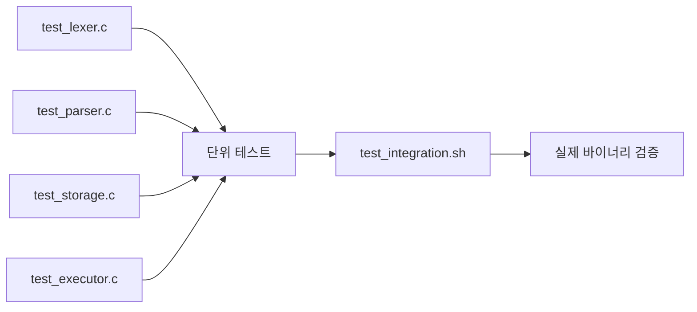

### 테스트 실행

```sh
make && make test
```

### 검증 포인트

* Lexer: token 분해가 정확한가
* Parser: AST가 정확히 만들어지는가
* Storage: escape/unescape와 row read/write가 정확한가
* Executor: INSERT/SELECT 규칙이 정확한가
* Integration: 실제 바이너리 실행 결과가 기대값과 같은가

`test_integration.sh`는 `sql_processor` 실행 파일을 사용하므로, 깨끗한 상태에서는 `make`로 먼저 바이너리를 만든 뒤 `make test`를 실행하는 흐름이 가장 안전하다.

테스트에서는 정상 동작만 보지 않았다.  
여러 문장이 한 파일에 들어간 경우, `WHERE` 결과가 0건인 경우, 중복 `id` 삽입, 스키마 파일 변경 뒤 기존 row를 다시 읽는 경우처럼 실제로 먼저 부딪힐 만한 상황을 같이 검증했다.  
즉, 추가 구현도 "기능을 더 붙였다"기보다 구조가 현실적인 입력과 데이터 변화에 어느 정도 버티는지 확인하는 과정에 가까웠다.

## 14. 예제 결과

### INSERT 결과

```text
INSERT 1
```

### SELECT 결과

```text
id | name  | age
----------------
1  | Alice | 20
2  | Bob   |

2 rows selected
```

## 15. 우리가 사용한 협업 방식

이번 프로젝트는 구현만 나누지 않고, 이해의 깊이도 시간대별로 나눠서 가져갔다.

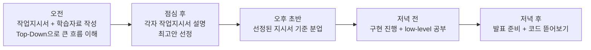

### 이 방식의 장점

* 처음부터 구현에 뛰어들지 않고, 전체 구조를 먼저 공유할 수 있었다.
* 작업지시서와 학습자료를 분리해 “구현”과 “이해”를 동시에 챙길 수 있었다.
* 오후에는 기능 분업, 저녁에는 코드 리딩과 발표 준비로 전환해 학습 효율이 높았다.

### 우리 팀이 실제로 가져간 관점

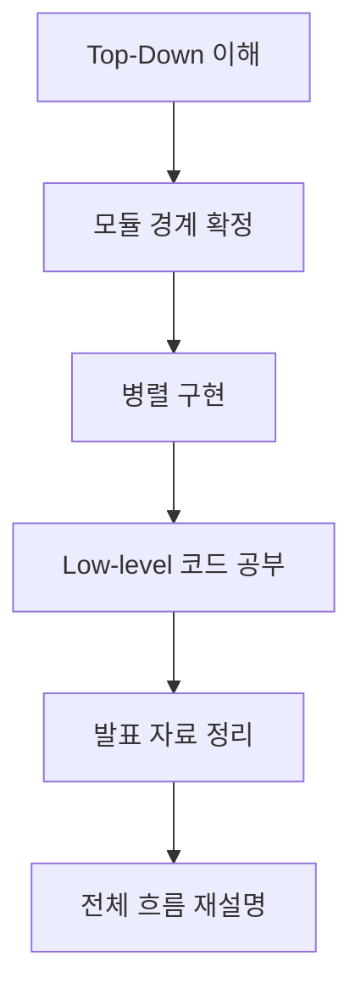

즉, 오전에는 "전체 그림", 오후에는 "세부 구현", 저녁에는 "설명 가능한 이해"로 전환하는 식으로 협업했다.
이 방식 덕분에 먼저 경계를 정한 뒤 병렬 구현을 할 수 있었고, 이후에 `WHERE`, 다중 SQL 처리, 무결성 검사 같은 확장도 기존 구조를 크게 흔들지 않고 붙일 수 있었다.

## 16. 처음 읽을 때 추천하는 코드 읽기 순서

이 순서는 Top-Down 학습에 가장 잘 맞는다.

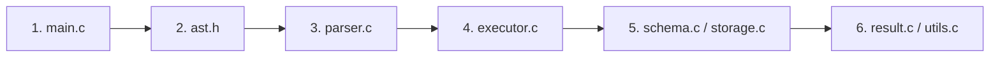

이 순서가 좋은 이유는 아래와 같다.

* `main.c`: 전체 흐름이 보인다.
* `ast.h`: 프로그램이 SQL을 어떤 구조로 이해하는지 보인다.
* `parser.c`: 문자열이 AST로 바뀌는 지점이 보인다.
* `executor.c`: 가장 중요한 실행 규칙이 보인다.
* `schema.c`, `storage.c`: 파일 기반 DB의 실제 동작이 보인다.
* `result.c`, `utils.c`: 출력과 보조 로직을 마무리로 이해할 수 있다.

## 17. 엣지 케이스

다음 항목을 주요 검증 대상으로 둔다.

* 빈 SQL 파일
* 닫히지 않은 문자열
* 잘못된 토큰
* 여러 줄 SQL
* 여러 문장이 한 파일에 들어간 경우
* 존재하지 않는 테이블
* 존재하지 않는 컬럼
* `INSERT` 값 개수 불일치
* schema 파일 비어 있음
* 스키마 컬럼 추가/제거 뒤 기존 row 읽기
* 부분 컬럼 `INSERT`
* 중복 `id` 삽입 차단
* `WHERE` 결과가 0건인 경우
* `SELECT *`와 partial `SELECT`

## 18. 한계와 향후 개선점

### 현재 한계

* `WHERE column = literal`까지만 지원
* 타입 시스템이 단순해 숫자와 문자열을 느슨하게 다룸
* 유일성 검사는 현재 `id` 컬럼만 대상으로 함
* 저장 포맷이 positional 기반이라 컬럼 이름 단위의 완전한 스키마 진화까지는 지원하지 않음
* 인덱스와 트랜잭션은 지원하지 않음
* SQL comment, 복합 조건, 복잡한 문법은 아직 처리하지 않음

### 향후 개선

* `AND`, `OR`, `<`, `>` 같은 확장 WHERE
* SQL comment 무시
* 출력 정렬 고도화
* `NULL` 지원
* 컬럼 이름 기반 저장 포맷으로 스키마 변경 대응 강화

## 19. 발표용 한 줄 정리

```text
이 프로젝트는 SQL 문자열을 token으로 자르고,
AST로 구조화하고,
그 구조를 파일 기반 DB 위에서 실행하면서,
현실적인 입력과 데이터 변화까지 조금 더 다뤄 보려 한 작은 SQL 처리기다.
```
