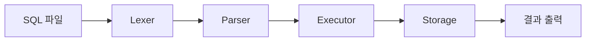
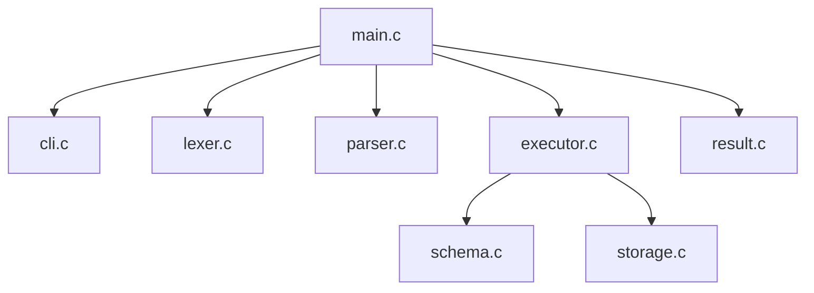
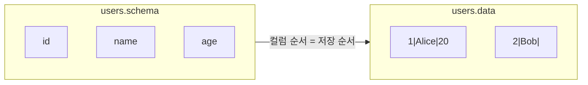
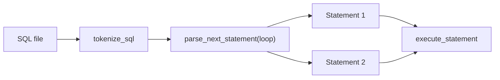
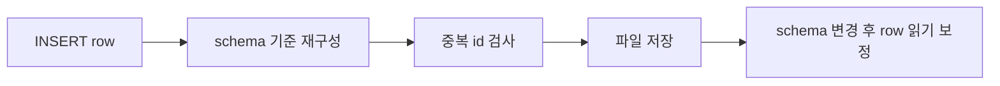
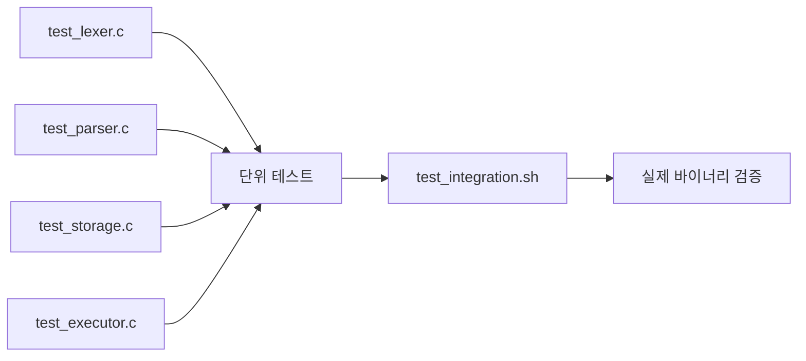

# SQL Parser Engine

## 1. 도입



- 과제 해석: SQL 기능 2개 구현보다 처리기 구조 구현
- 기준: `입력 -> 파싱 -> 실행 -> 저장 -> 출력`
- 목표: `main -> parser -> executor -> storage` 흐름 설명 가능
- 지원: `INSERT`, `SELECT`, `WHERE column = literal`
- 추가 구현: 여러 줄 SQL, 여러 문장 SQL, `id` 중복 차단, 스키마 변경 후 기존 row 읽기
- 제외: `CREATE TABLE`, `UPDATE`, `DELETE`, `JOIN`, 복합 `WHERE`, 인덱스, 트랜잭션

## 2. 구조를 어떻게 잡았는가




- 핵심 추상화: `Token`, `AST`, `Row`
- 해석 기준: 문자열 직접 실행 X / 구조 기반 실행 O
- 호출 흐름: `main -> read_text_file -> tokenize_sql -> parse_next_statement -> execute_statement`
- 모듈 책임:
- `Lexer`: token 분해
- `Parser`: AST 생성
- `Executor`: 실행 규칙 적용
- `Storage`: 파일 I/O

## 3. 설계 선택 1: 저장 포맷을 어떻게 볼 것인가



| 후보 | 장점 | 한계 |
| --- | --- | --- |
| binary | 빠른 처리 가능 | 사람이 읽기 어려움 |
| CSV | 익숙한 형식 | 구분/escape 관리 부담 |
| `\|` text | 직접 확인 쉬움 | 성능 최적화 목적과는 거리 |

- 문제: 디버깅과 테스트에서 파일 직접 확인 필요
- 선택: `|` 구분자 텍스트 포맷
- 의미: 기대값 비교 용이, 파일 상태 확인 용이, 발표 데모 용이
- 저장 규칙: 한 줄 = 한 row, 명시되지 않은 값 = `""`, escape = `\\`, `\|`, `\n`

## 4. 설계 선택 2: 입력 처리 문제와 개선



- 문제 1: SQL 파일이 두 줄 이상이면 초기 구현이 깨짐
- 선택 1: `parse_next_statement(loop)` 기반 순차 실행
- 의미 1: 여러 줄 SQL 처리, 여러 문장 SQL 처리, 세미콜론 단위 실행
- 문제 2: `SELECT *`만으로 구조 확장성 확인 어려움
- 선택 2: `WHERE column = literal`
- 의미 2: Parser -> Executor 확장성 확인, 조건 필터와 projection 분리

## 5. 설계 선택 3: 파일 기반 DB에도 최소한의 원칙은 필요하다고 봤다



- 문제 1: 중복 `id` 허용 시 데이터 모호
- 선택 1: 삽입 전 기존 row와 `id` 비교
- 의미 1: 파일 기반 DB에서도 최소 무결성 확보
- 문제 2: `db` 디렉터리의 schema 파일이 바뀌면 기존 row와 불일치 가능
- 선택 2: row가 짧으면 빈 값 채움, 길면 잘라냄
- 의미 2: 코드와 데이터 구조의 결합 완화, 파일 기반 DB 유연성 확보

## 6. 시행착오와 구조 변경

- 처음 상태: 기본 요구사항 우선 구현
- 바로 드러난 문제: 여러 줄 SQL, 중복 `id`, schema 변경
- 수정 방향: 기능 추가보다 입력과 데이터 변화에 버티는 구조
- 결과: 구조 유지 + 예외 대응 범위 확장

## 7. 테스트와 검증



- 실행: `make && make test`
- 단위 테스트: Lexer, Parser, Storage, Executor
- 통합 테스트: 실제 바이너리 실행 결과
- 확인 항목: 여러 문장 SQL, `WHERE` 결과 0건, 중복 `id`, 스키마 변경 후 row 읽기

## 8. 데모


```sh
make
./sql_processor -d ./db -f ./queries/insert_users.sql
./sql_processor -d ./db -f ./queries/select_users.sql
./sql_processor -d ./db -f ./queries/select_user_where.sql
./sql_processor -d ./db -f ./queries/multi_statements.sql
```

- 데모 포인트: 기본 흐름, `WHERE`, 여러 문장 SQL, 파일 상태 변화

## 9. 협업 방식


- 협업 순서: Top-Down 이해 -> 모듈 경계 확정 -> 병렬 구현 -> Low-level 확인 -> 발표 정리
- 장점: 구현 속도와 코드 이해를 함께 확보

## 10. 마무리